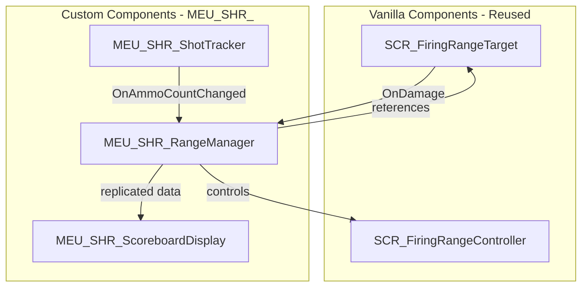

# 15th MEU Shooting Range - MVP Implementation Plan

Single-lane shooting range with pop-up/fold-down controls and world-space scoreboard.

---

## User Review Required

> [!IMPORTANT]
> **Shots Fired Tracking**: The vanilla scoring system only tracks hits (`m_iScore`) and max potential (`m_iScoreMax`). To track **shots fired** separately, we need to extend this. The approach uses `EventHandlerManagerComponent.OnAmmoCountChanged` which fires when ammo decreases (a shot was taken).

---

## Architecture Overview



**Key Simplification**: We reuse vanilla `SCR_FiringRangeTarget` and `SCR_FiringRangeController` directly, only adding custom components for:
1. Extended score tracking (shots fired/hit/missed)
2. Shot-fired detection via `OnAmmoCountChanged`
3. World-space scoreboard display

---

## Proposed Changes

### Scripts (`Scripts/Game/ShootingRange/`)

#### [NEW] [MEU_SHR_ScoreData.c](file:///c:/Users/patri/Nextcloud/Projects/15th%20MEU/15th_Mods/15th_MEU_ShootingRange/Scripts/Game/ShootingRange/MEU_SHR_ScoreData.c)

Extended score data per player:

```c
class MEU_SHR_ScoreData
{
    int m_iPlayerId;
    int m_iShotsFired;   // Total rounds discharged
    int m_iShotsHit;     // Successful target impacts
    
    int GetShotsMissed() { return m_iShotsFired - m_iShotsHit; }
    float GetAccuracy()  { return m_iShotsFired > 0 ? (m_iShotsHit * 100.0 / m_iShotsFired) : 0; }
}
```

---

#### [NEW] [MEU_SHR_RangeManagerComponent.c](file:///c:/Users/patri/Nextcloud/Projects/15th%20MEU/15th_Mods/15th_MEU_ShootingRange/Scripts/Game/ShootingRange/MEU_SHR_RangeManagerComponent.c)

**Placeable manager entity for mission makers**. Attach to a `GenericEntity` in the world.

**Attributes:**
| Attribute | Type | Description |
|-----------|------|-------------|
| `m_Target` | `SCR_FiringRangeTarget` | Reference to the lane's target |
| `m_Scoreboard` | `IEntity` | Reference to scoreboard prop |
| `m_iLanePlayerId` | `int` | Player assigned to this lane (-1 = none) |

**Key Methods:**
| Method | Description |
|--------|-------------|
| `RegisterShotFired(int playerId)` | Called by shot tracker |
| `RegisterHit(int playerId)` | Called when target hit detected |
| `GetScoreData(int playerId)` | Returns score data |
| `ClearScores()` | Reset all scores |
| `PopUpTarget()` | Raises target via `SetState(ETargetState.TARGET_UP)` |
| `FoldDownTarget()` | Lowers target via `SetState(ETargetState.TARGET_DOWN)` |

**Networking:**
- Uses `[RplProp()]` for score replication
- Server-authoritative (all modifications via RPCs)

---

#### [NEW] [MEU_SHR_ShotTrackerComponent.c](file:///c:/Users/patri/Nextcloud/Projects/15th%20MEU/15th_Mods/15th_MEU_ShootingRange/Scripts/Game/ShootingRange/MEU_SHR_ShotTrackerComponent.c)

Attach to player entity (or game mode) to track shots fired.

**Approach:** Uses `EventHandlerManagerComponent.RegisterScriptHandler("OnAmmoCountChanged", ...)` - same pattern as `SCR_WeaponInfoVehicle.AddEventHandlers()`:

```c
protected void AddEventHandlers(IEntity owner)
{
    EventHandlerManagerComponent evtMgr = EventHandlerManagerComponent.Cast(
        owner.FindComponent(EventHandlerManagerComponent));
    if (evtMgr)
        evtMgr.RegisterScriptHandler("OnAmmoCountChanged", this, OnAmmoCountChanged);
}

protected void OnAmmoCountChanged(BaseWeaponComponent weapon, 
                                   BaseMuzzleComponent muzzle, 
                                   BaseMagazineComponent magazine, 
                                   int ammoCount, 
                                   bool isBarrelChambered)
{
    // Ammo decreased = shot fired
    if (ammoCount < m_iPreviousAmmo)
    {
        MEU_SHR_RangeManagerComponent mgr = GetRangeManager();
        if (mgr)
            mgr.RegisterShotFired(GetPlayerId());
    }
    m_iPreviousAmmo = ammoCount;
}
```

---

#### [NEW] [MEU_SHR_TargetHitComponent.c](file:///c:/Users/patri/Nextcloud/Projects/15th%20MEU/15th_Mods/15th_MEU_ShootingRange/Scripts/Game/ShootingRange/MEU_SHR_TargetHitComponent.c)

Attach to `SCR_FiringRangeTarget` to report hits to the range manager.

**Approach:** Override `OnDamage` behavior, extract player from `instigator`:

```c
override void OnDamage(float damage, EDamageType type, IEntity pHitEntity, 
                       inout vector outMat[3], IEntity damageSource, 
                       notnull Instigator instigator, int colliderID, float speed)
{
    super.OnDamage(damage, type, pHitEntity, outMat, damageSource, instigator, colliderID, speed);
    
    int playerId = instigator.GetInstigatorPlayerID();
    MEU_SHR_RangeManagerComponent mgr = GetRangeManager();
    if (mgr)
        mgr.RegisterHit(playerId);
}
```

---

#### [NEW] [MEU_SHR_RangemasterActions.c](file:///c:/Users/patri/Nextcloud/Projects/15th%20MEU/15th_Mods/15th_MEU_ShootingRange/Scripts/Game/ShootingRange/MEU_SHR_RangemasterActions.c)

User actions for control panel:

| Action Class | Function |
|--------------|----------|
| `MEU_SHR_PopUpTargetAction` | Calls `manager.PopUpTarget()` |
| `MEU_SHR_FoldDownTargetAction` | Calls `manager.FoldDownTarget()` |
| `MEU_SHR_ClearScoresAction` | Calls `manager.ClearScores()` |

---

#### [NEW] [MEU_SHR_ScoreboardDisplayComponent.c](file:///c:/Users/patri/Nextcloud/Projects/15th%20MEU/15th_Mods/15th_MEU_ShootingRange/Scripts/Game/ShootingRange/MEU_SHR_ScoreboardDisplayComponent.c)

World-space scoreboard on a prop. Uses `RenderTargetWidget` for screen display.

**Display Format:**
```
┌─────────────────────────┐
│   SHOOTING RANGE        │
├─────────────────────────┤
│ Player: [Name]          │
│ Shots Fired:   12       │
│ Shots Hit:      8       │
│ Shots Missed:   4       │
│ Accuracy:      67%      │
└─────────────────────────┘
```

---

## Prefab Creation Instructions

> [!NOTE]
> Create these prefabs in Workbench to generate proper GUIDs. Below are the required components for each.

### 1. MEU_SHR_RangeManager.et

**Base**: `GenericEntity`

| Component | Configuration |
|-----------|---------------|
| `RplComponent` | Enable replication |
| `MEU_SHR_RangeManagerComponent` | Your custom script component |

**Attributes to expose:**
- `m_Target` - EntityLink to target
- `m_Scoreboard` - EntityLink to scoreboard

---

### 2. MEU_SHR_ControlPanel.et

**Base**: `GenericEntity` (or existing control panel prop)

| Component | Configuration |
|-----------|---------------|
| `SCR_ActionsManagerComponent` | Manages user actions |
| `MEU_SHR_PopUpTargetAction` | User action |
| `MEU_SHR_FoldDownTargetAction` | User action |
| `MEU_SHR_ClearScoresAction` | User action |

**Hierarchy:**
```
MEU_SHR_ControlPanel.et
├── MeshObject (control panel model)
├── SCR_ActionsManagerComponent
└── UserActions/
    ├── MEU_SHR_PopUpTargetAction
    ├── MEU_SHR_FoldDownTargetAction
    └── MEU_SHR_ClearScoresAction
```

---

### 3. MEU_SHR_Scoreboard.et

**Base**: `GenericEntity`

| Component | Configuration |
|-----------|---------------|
| `MeshObject` | Scoreboard prop model (or placeholder box) |
| `RplComponent` | Enable replication |
| `MEU_SHR_ScoreboardDisplayComponent` | Your display script |

**Note**: For world-space UI, you'll need a material with `RenderTargetWidget`. This can be configured post-MVP.

---

### 4. Target Setup (Use Vanilla)

Use existing `SCR_FiringRangeTarget` prefab from vanilla. Add:

| Component | Configuration |
|-----------|---------------|
| `MEU_SHR_TargetHitComponent` | Your hit detection script |

---

## Folder Structure

```
15th_MEU_ShootingRange/
├── addon.gproj
├── README.md
├── Scripts/
│   └── Game/
│       └── ShootingRange/
│           ├── MEU_SHR_ScoreData.c
│           ├── MEU_SHR_RangeManagerComponent.c
│           ├── MEU_SHR_ShotTrackerComponent.c
│           ├── MEU_SHR_TargetHitComponent.c
│           ├── MEU_SHR_RangemasterActions.c
│           └── MEU_SHR_ScoreboardDisplayComponent.c
├── UI/
│   └── layouts/
│       └── MEU_SHR_ScoreboardLayout.layout
└── Prefabs/
    └── ShootingRange/
        ├── MEU_SHR_RangeManager.et      (user creates)
        ├── MEU_SHR_ControlPanel.et      (user creates)
        └── MEU_SHR_Scoreboard.et        (user creates)
```

---

## Verification Plan

### In-Editor Testing

1. **Target Controls**
   - Use control panel → Pop Up action
   - Verify target raises (animation plays)
   - Use Fold Down action
   - Verify target lowers

2. **Hit Detection**
   - Fire at target
   - Check logs for `RegisterHit` call
   - Verify `m_iShotsHit` increments

3. **Shot Tracking**
   - Fire weapon (at target or elsewhere)
   - Verify `m_iShotsFired` increments per shot

4. **Scoreboard Display**
   - Verify scoreboard shows correct values
   - Verify accuracy calculation

### Multiplayer (Dedicated Server)

- Verify score replication across clients
- Verify rangemaster actions work from any client
- Verify scores persist across player reconnect (optional)

---

## Implementation Order

1. `MEU_SHR_ScoreData.c` - Data class
2. `MEU_SHR_RangeManagerComponent.c` - Core manager
3. `MEU_SHR_TargetHitComponent.c` - Hit detection
4. `MEU_SHR_ShotTrackerComponent.c` - Shot tracking
5. `MEU_SHR_RangemasterActions.c` - Control actions
6. `MEU_SHR_ScoreboardDisplayComponent.c` - Display (can be simplified for MVP)
7. **User creates prefabs in Workbench**
8. Integration testing
